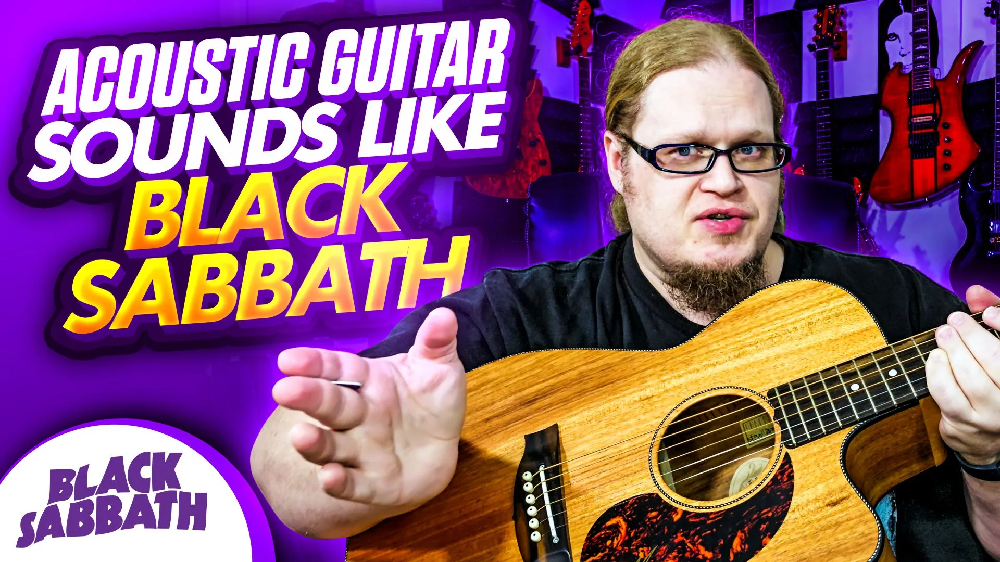

# I made my acoustic sound like Black Sabbath

## Backed-up images

---
How I set up my Maton EBW808 to sound like Tony Iommi's tone from early Black Sabbath

Products Used:

Maton EBW808: https://maton.com.au/product/ebw808
Fractal FM9: https://shop.fractalaudio.com/fm9-turbo-w
Black Diamond Strings: https://blackdiamondstrings.com/
Vegas Pro: https://www.vegascreativesoftware.com/us/vegas-pro/
Camera: Samsung Galaxy S23: https://www.samsung.com/us/smartphones/galaxy-s23-ultra/
