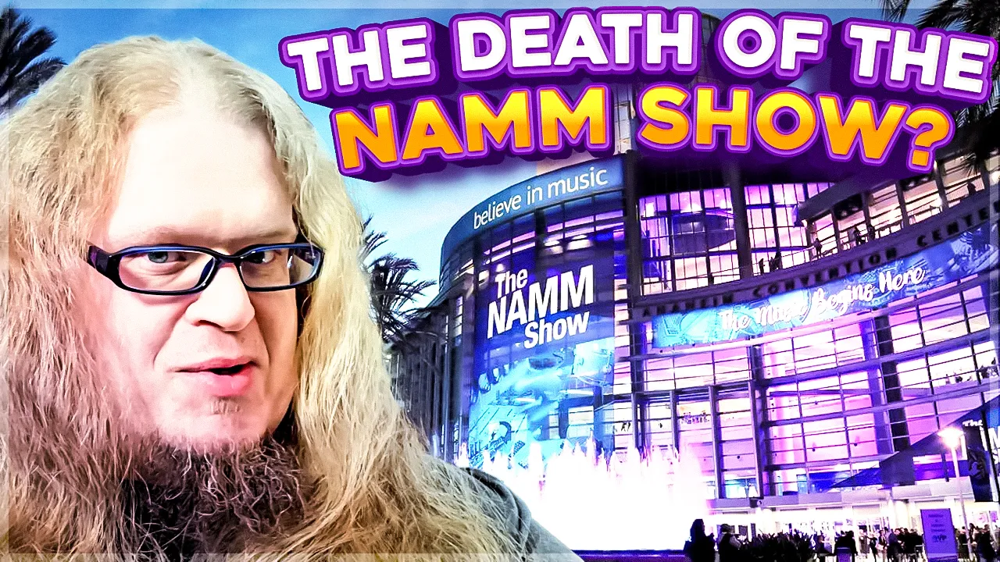

# The Death of the NAMM Show?

## Backed-up images

---
Explore the NAMM Show with 'The Melodic Marketer,' hosted by the great and powerful, Dr. OMEB. In this episode, we look into the significant changes at the NAMM Show over the years, particularly the trend of major brands like Gibson and Fender stepping back from this iconic music industry event. Discover how this shift is reshaping the landscape of music merchandising and what it means for the future of music trade shows. Join me as we analyze the impact of these changes on the industry and hypothesize what the future holds for events like the NAMM Show. We discuss everything from the history of the NAMM Show, how The Beatles changed the music merchant industry, to the current trends in direct-to-consumer sales and digital marketing strategies. We'll also look at the transformation of the NAMM Show from an exclusive, industry-only event to a more inclusive and public affair, and what this means for music professionals and enthusiasts alike.

🎸 Key Topics Covered: The History of the NAMM Show

🎸 Why Major Brands Are Withdrawing from NAMM

🎸 The Shift to Direct-to-Consumer Sales in the Music Industry

🎸 The Future of Music Trade Shows

#NAMMShow #MusicIndustry #DirectToConsumer #MusicBusiness #TheBeatles #edsullivan #TheMelodicMarketer #GibsonGuitar #FenderGuitar #Gibson #Fender #TheEdSullivanShow

Subscribe https://www.youtube.com/channel/UCPrM\_LMrNRevsumUPPwmhwg?sub\_confirmation=1

Products Used:

🎤 EV RE20 Microphone: https://www.sweetwater.com/store/detail/RE20Bun--electro-voice-re20-broadcast-microphone-with-shockmount-and-windscreen

🎛️ SSL 2+ Interface: https://www.sweetwater.com/store/detail/SSL2Plus--solid-state-logic-ssl2-usb-audio-interface

🎞️ Vegas Pro: https://www.vegascreativesoftware.com/us/vegas-pro/

🎥 Camera: Samsung Galaxy S23: https://www.samsung.com/us/smartphones/galaxy-s23-ultra/

🌐 check out my website

🌐 www.omebrocks.com

- 00:00 Introduction
- 00:31 The History of NAMM
- 01:19 The Evolution of NAMM
- 01:45 How the Beatles Changed NAMM
- 02:24 Capturing the British Invasion Market
- 03:13 Gibson, Fender, & PRS Bail on NAMM
- 04:13 What's the Modern Value Prop for NAMM?
- 04:45 Is This the End for Trade Shows?
- 05:21 The Demographics Are Shifting
- 06:19 Is NAMM Comic-Con for Musicians?
- 07:10 Does NAMM Have an Identity Crisis?
- 07:45 Is the Gibson Garage the New Model?
- 08:33 Changes in Consumer Behavior
- 09:05 Outro
