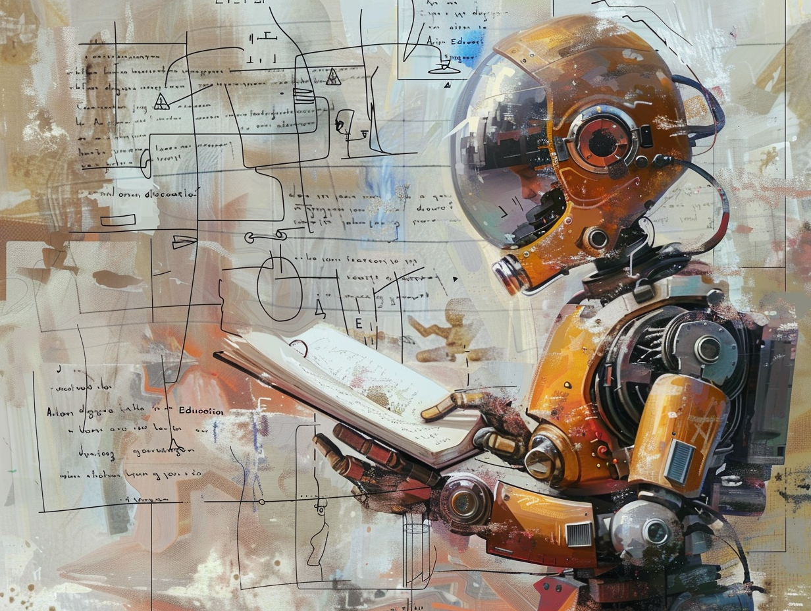

# Why Teachers and Students Should Be Using ChatGPT (AI)

## Backed-up images

---
Artificial Intelligence (AI) is transforming education, offering powerful tools to enhance teaching and learning. Teachers and students alike can benefit from integrating AI into their daily routines. I'll include a few helpful prompts for teachers and students at the end of this blog post. Here’s why AI is essential in modern education.

### Personalized Learning

AI can create personalized learning experiences tailored to individual student needs. Adaptive learning platforms adjust content based on a student's progress, providing targeted support where it's needed most. This customization helps students understand complex topics more effectively and at their own pace.

### Efficient Administrative Tasks

Teachers often spend significant time on administrative tasks such as grading and lesson planning. AI tools can automate these tasks, freeing up valuable time for educators to focus on teaching and interacting with students. Automated grading systems, for example, provide instant feedback on assignments, helping students learn from their mistakes promptly.

### Enhanced Student Engagement

Interactive AI tools, such as virtual tutors and educational games, make learning more engaging for students. These tools offer real-time feedback and interactive content that can make complex subjects more accessible and enjoyable. By incorporating AI into lessons, teachers can maintain high levels of student interest and participation.

### Skill Development

AI encourages the development of critical 21st-century skills. For students, using AI tools can enhance problem-solving abilities, critical thinking, and creativity. These skills are vital for success in the modern workforce, where AI is becoming increasingly prevalent.

### Inclusive Education

AI-powered tools can support diverse learners and make education more inclusive. For instance, speech-to-text and text-to-speech technologies can assist students with disabilities, ensuring they have equal access to learning materials. AI can also translate content in real-time, helping non-native speakers understand lessons better.

### Future-Ready Education

Preparing students for future careers is a key responsibility of educators. Familiarity with AI and its applications is becoming crucial as many industries adopt AI technologies. By integrating AI into the curriculum, teachers can ensure that students are well-equipped with the skills needed for the jobs of tomorrow.

### Conclusion

AI offers significant benefits for both teachers and students, enhancing personalized learning, improving administrative efficiency, and fostering essential skills. Embracing AI in education can create a more engaging, inclusive, and future-ready learning environment. Teachers and students should take advantage of AI tools to unlock new possibilities in education and stay ahead in an evolving technological landscape.

### Prompts for Teachers

1. **Lesson Planning**:
   - "Create a lesson plan for a high school marketing class focusing on digital marketing strategies." (Customize this prompt with specific digital platforms, industry, or other marketing concepts).
2. **Assignment Ideas**:
   - "Suggest five creative assignments for a middle school history class studying Ancient Egypt." (Customize this prompt to add more specifics, like which dynasty, specific areas of Egypt, etc..)
3. **Feedback Generation**:
   - "Provide constructive feedback for a student's essay on climate change, focusing on strengths and areas for improvement." (You'll need to copy or upload the student's essay, and assignment specifics, into ChatGPT)
4. **Classroom Activities**:
   - “Design an engaging classroom activity to teach elementary students about fractions.”
5. **Differentiated Instruction**:
   - "How can I differentiate instruction for a mixed-ability classroom learning about the water cycle?"
6. **Parent Communication**:
   - "Draft an email to parents explaining the importance of the upcoming science fair and how they can support their children."
7. **Professional Development**:
   - "List five professional development workshops for teachers to enhance their skills in using technology in the classroom."
8. **Behavior Management**:
   - "What are some effective strategies for managing classroom behavior in a high school setting?"
9. **Incorporating AI**:
   - "How can I integrate AI tools like ChatGPT into my curriculum to support personalized learning?"
10. **Assessment Strategies**:
    - "Develop a rubric for assessing a group project on renewable energy sources for a 10th-grade science class."

### Prompts for Students

1. **Essay Assistance**:
   - "Help me brainstorm ideas for an essay on the impact of social media on teenagers."
2. **Study Tips**:
   - "What are some effective study techniques for memorizing vocabulary words in a foreign language?"
3. **Homework Help**:
   - "Explain the process of photosynthesis in simple terms for my biology homework."
4. **Project Ideas**:
   - "Suggest some project ideas for a science fair that involves renewable energy." (Customize the prompt by adding “Give me 10 ideas in the form of bullet points.”)
5. **Career Exploration**:
   - "What are some potential career paths for someone interested in computer science?"
6. **Exam Preparation**:
   - "Create a study schedule to help me prepare for my upcoming history exam." (Customize this prompt to include topics that will be covered on the history exam.)
7. **Creative Writing**:
   - "Give me a creative writing prompt about a world where humans can communicate with animals."
8. **Math Problem Solving**:
   - "Walk me through the steps to solve this algebra equation: 2x + 3 = 15." (Add a secondary prompt, “Explain this to me like a 10 year old.”)
9. **Research Guidance**:
   - "Help me create an outline my research paper on the effects of pollution on marine life?"
10. **Learning New Skills**:
    - "What are some beginner-friendly coding languages and resources to start learning how to code?"
