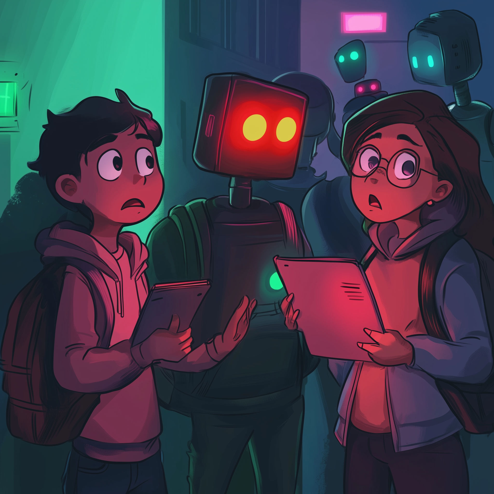

# Red Light, Green Light: How I’m Structuring AI Use in My Classes 🚦🎭

## Backed-up images

---
Red Light, Green Light: How I’m Structuring AI Use in My Classes 🚦🎭

Higher ed has a huge gap when it comes to setting guardrails for AI use in the classroom. Instead of banning it outright or letting students run wild with it, I’ve started using a Red Light, Green Light system—yes, like Squid Game, but with fewer casualties.

Here’s how it works:

🛑 Red Light (No AI Allowed) – Discussion boards: Why? Because I need to see how my students write and teach them to improve. If AI is doing the thinking for them, there’s no critical assessment, just a copy-paste parade.

🟡 Yellow Light (AI-Assisted, Not AI-Generated) – Research projects: Students can use AI to gather information, but they can’t use it to write deliverables. This forces them to verify sources, synthesize data, and form their own insights instead of letting ChatGPT do it for them.

🟢 Green Light (AI-Integrated) – In-class projects & same-day presentations: Students can use AI to research and build slides, but they still need to decide what’s important and present it themselves. AI isn’t replacing their work—it’s making them think about what matters.

I believe this kind of structured AI integration is where higher ed needs to go. The real world isn’t banning AI, so our job is to teach students how to use it responsibly.

How are you adapting your policies around AI in education?

[hashtag#HigherEd](https://www.linkedin.com/feed/hashtag/?keywords=highered&highlightedUpdateUrns=urn%3Ali%3Aactivity%3A7294746223872286720) [hashtag#AIinEducation](https://www.linkedin.com/feed/hashtag/?keywords=aiineducation&highlightedUpdateUrns=urn%3Ali%3Aactivity%3A7294746223872286720) [hashtag#AI](https://www.linkedin.com/feed/hashtag/?keywords=ai&highlightedUpdateUrns=urn%3Ali%3Aactivity%3A7294746223872286720) [hashtag#ArtificialIntelligence](https://www.linkedin.com/feed/hashtag/?keywords=artificialintelligence&highlightedUpdateUrns=urn%3Ali%3Aactivity%3A7294746223872286720) [hashtag#EdTech](https://www.linkedin.com/feed/hashtag/?keywords=edtech&highlightedUpdateUrns=urn%3Ali%3Aactivity%3A7294746223872286720) [hashtag#CriticalThinking](https://www.linkedin.com/feed/hashtag/?keywords=criticalthinking&highlightedUpdateUrns=urn%3Ali%3Aactivity%3A7294746223872286720)
