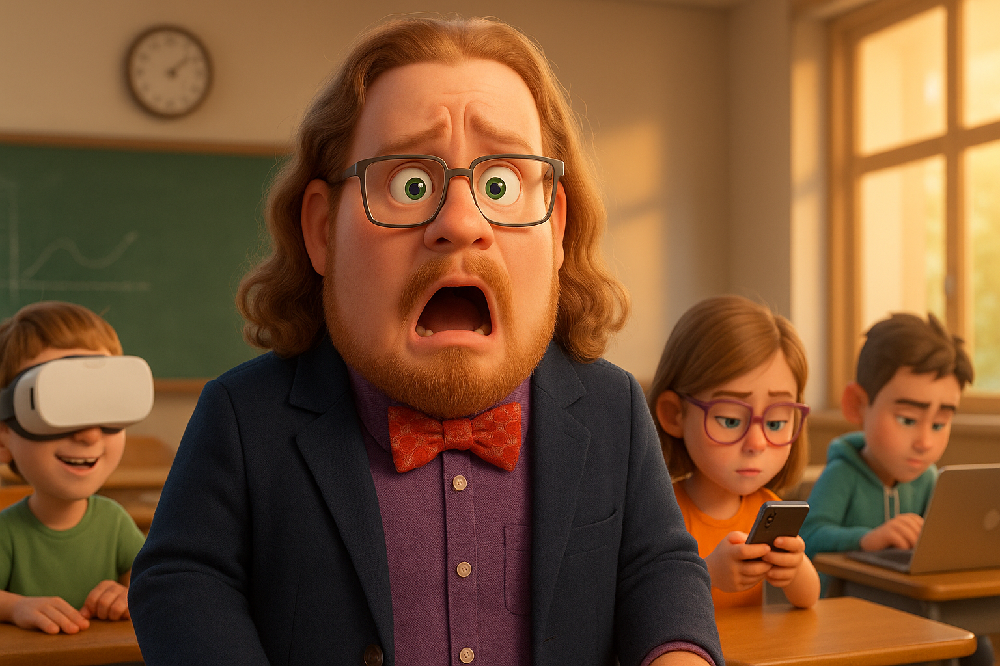

# AI in the Classroom: Stop Panicking, Start Preparing

## Backed-up images

---
So, AI. It's here. Your students are probably using it more than you realize, and let's be honest, it's causing some heartburn in education. The big question on every educator's mind: How do we "AI proof" our classrooms?

If your first instinct is to ban it, hit the brakes. That’s like trying to stop a tidal wave with a Post-it note. It’s not just ineffective; it’s a missed opportunity. Students are already using AI for everything from trying to get full essays to translating languages. Ignoring it or simply forbidding it won't stop them; it just stops you from guiding them.

**The Real Problem: Not AI, But How It's Used (Or Misused)**

Let's face it, without clear guidelines, students might let AI do all their work, completely missing the learning process. No critical thinking, just copy-pasting. That's not what any of us want. So, how do we fix this? We give them clear rules of the road.

**Enter: The "Red Light, Green Light" System for AI Use**

To cut through the confusion, I use a simple traffic light system in my assignment instructions. It tells students exactly when and how AI can (and cannot) be part of their work.

**RED LIGHT: No AI Allowed. Full Stop.**

- These are AI-Free Zones. Think discussion boards or any assignment where the goal is to see *their* undiluted thoughts and writing.
- Why? Because AI can strip away the critical analysis and original thought we're trying to cultivate.
- The policy is blunt: Use AI here, and you fail the assignment.

**YELLOW LIGHT: Caution! AI as an Assistant, NOT the Author.**

- Here, AI can help with *parts* of the process, like research papers or projects.
- What's Okay: Using AI to summarize sources (that they've found and read), brainstorm initial ideas, or organize research.
- What's NOT Okay: Copy-pasting AI-generated content. Letting AI write the paper. They still have to be the primary thinker and author.

**GREEN LIGHT: AI Allowed (Strategically).**

- This is for tasks where AI can be a genuine productivity booster, like prepping for in-class presentations or certain research tasks.
- How it can be used: Brainstorming ideas, generating *initial* text for slides (which they then own and refine), or improving efficiency.
- The Goal: Students learn to vet AI outputs and present ideas effectively, often under pressure.

This system works because it teaches students to *think*, not just automate. They learn when and how to use AI properly, avoiding dependency and those pesky plagiarism traps.

**Beyond Rules: Smart AI Integration**

Guardrails are just the start. We can also make AI a learning lever. Think about using AI as:

- A **brainstorming partner** (students then curate and build).
- A **"devil's advocate"** to generate counterarguments students must then analyze.
- A tool for **summarizing complex texts** (with mandatory student verification, of course).
- A **practice dummy** where students critique AI-generated content for flaws, bias, or accuracy.

**The Golden Rule: If AI Helped, Explain It. In Detail.**

This is non-negotiable. If students use AI, they *must* explain how. This means sharing:

- Their prompts and chat history.
- "Before and after" snippets of their work if AI assisted with writing.
- Their own critique of the AI's contribution – what was useful, what wasn't, what they changed and why.

This keeps them accountable and ensures the learning stays with them, not the machine.

**The Bottom Line**

"AI Proofing" isn't about building impenetrable walls. It's about smart preparation, clear communication, and adapting how we teach and assess. AI isn't the enemy; uncritical thinking and laziness are. Let's use AI to enhance learning, not replace it.

What are your thoughts? How are you setting AI guardrails in your classroom? Drop a comment below.
