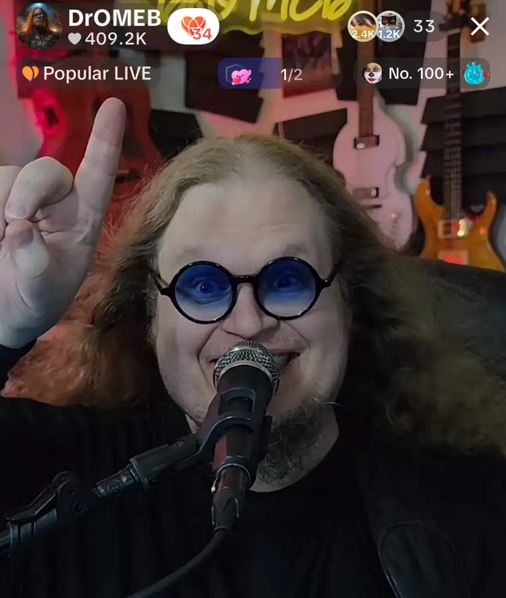
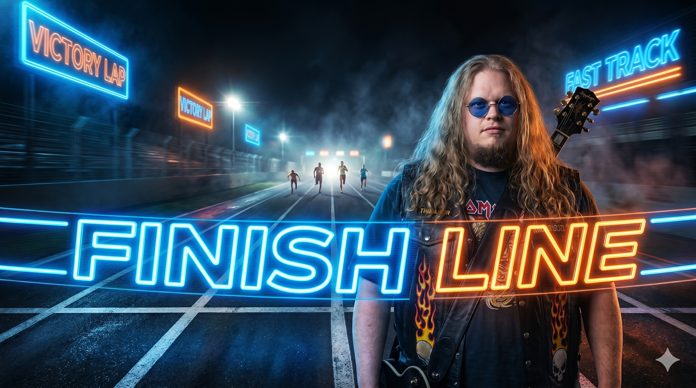
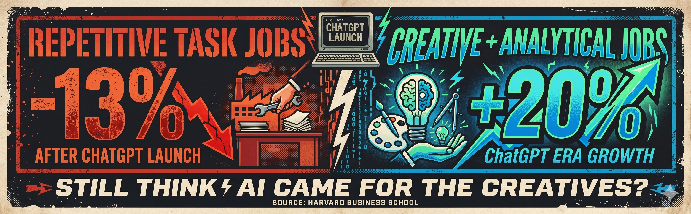
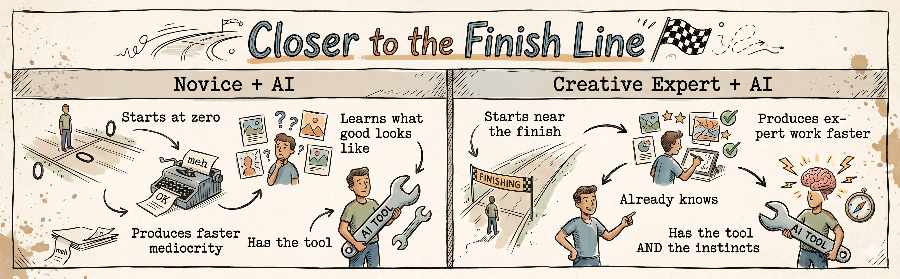
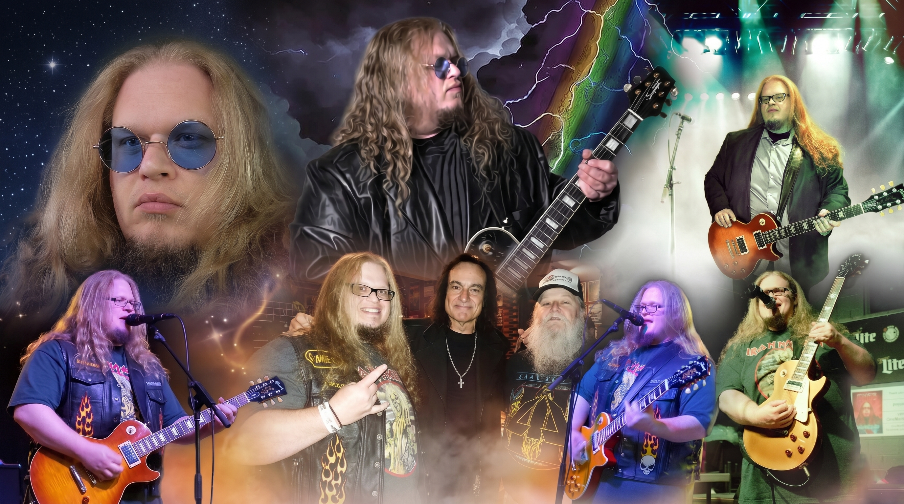

# Why AI Belongs in the Hands of Creative People (And Why Creatives Need to Stop Fearing It)

## Backed-up images

---

Citizens of Rock n' Roll,

Everyone is asking the wrong question about AI. The question isn't "will AI replace creative people?" The question is: *what happens when creative people get their hands on AI?* The answer… the finish line moves closer. A lot closer.

---

Let me give you a real-world example of what I mean. Put a graphic designer with twenty years of experience behind an AI image tool and tell them to build a campaign. Now put a complete novice behind the same tool and give them the same brief. Both are using identical technology. The results will not be identical — not even close. The designer knows what good looks like. They know composition, hierarchy, color theory, brand language. AI hands them a head start. Their expertise turns that head start into something worth looking at. The novice gets faster at producing mediocre work.

That's not an insult, it's just how leverage works. AI doesn't replace the twenty years. It amplifies them. A video editor using AI to cut a sizzle reel still needs to know what a sizzle reel *feels* like. A copywriter using AI to draft ad copy still needs to know what makes someone stop scrolling. A musician using AI tools in production still needs to know what a great song is supposed to do to a room. AI starts you closer to the finish line. But you still have to know where the finish line is. That's what the experts have over the novice, they know what an end product should look like.

---

And here's where the data gets interesting — because this isn't just a theory. After ChatGPT launched, Harvard Business School tracked what actually happened to the job market. What they found should be on a billboard: job postings for repetitive, structured tasks dropped 13%. Employer demand for jobs requiring creative and analytical thinking *grew 20%.* Read that again. Creative jobs didn't shrink, they got more valuable.

The jobs AI is eating are the jobs that were always kind of eating themselves — repetitive, predictable, interchangeable. The jobs AI is *growing* are the ones that require a human being with genuine perspective, taste, and experience to direct the work. Which is exactly what creative people have been building their whole careers. We just didn't know it was going to pay off like this.

---

I'll be honest with you. I spent a long time being the wrong guy in the wrong room. Too rock and roll for corporate. Too academic for the music scene. I spent seven years stuck in an entry-level job — not because I wasn't producing, but because "rock musician" read as a liability on an unwritten checklist nobody would show me. Multiple people told me to cut my hair. Actual advice given to me by a mentor, delivered with actual sincerity: *nobody in business will ever take you seriously with long hair and a goatee.* I didn't cut either.

Eventually I stopped trying to fit the room and just started making things. A small grocery store in Rivertown, Ohio asked me to help them compete against Kroger with basically no budget. So I made them a Pink Floyd parody that went globally viral and doubled their sales. One week I put "Boneless Bananas" on their weekly ad. They still run it to this day long after I left. A tiny independent grocery store has a marketing legacy because someone let the rock musician with the overactive brain take a full swing. That's not a case study. That's what happens when you stop sanding someone down to fit an obscure mold.

Now fast forward to fall 2023. A friend named Alexa Rae told me to get on TikTok. My exact response: *"Nobody's going to watch my old fat ass on TikTok."* She insisted. I went from 2,000 followers to 15,000 in under twelve months. Rock n' Roll Church — every Sunday 9AM EST — now draws between 3,000 and 10,000 live viewers. No label. No manager. No publicist. Just twenty years of knowing what the finish line looks like, and a platform that finally let me run the race.

---

AI showed up and did the same thing TikTok did, except it works every single day. My brain has always operated faster than my production capacity. Ideas just come in faster than I can execute them. AI closed that gap. I'm not working harder… I'm finally working at the speed I actually think and with a tool that can help me organize it all to production faster. Research, writing, content strategy, brainstorming… the bottleneck between the idea and the output is gone. I am basically one person operating with the output of a small agency. That's not magic. That's what happens when you put a serious tool in the hands of someone who knows what to do with it.

The internet is already drowning in what Merriam-Webster officially named its 2025 word of the year: *slop.* AI-generated content that's competent, generic, and completely forgettable. It all looks like it was made by the same invisible hand optimizing that keeps deviating towards the mean. Because the people generating it don't know where the finish line is, they're just running. Creative people know that knowledge is not replicable by a prompt.

---

Here's the bottom line, and I want you to sit with this one: AI didn't come for the artists. It came for the middlemen. It came for the infrastructure that stood between a good idea and an executed product and charged a toll to pass through. The gatekeepers. The "you need a budget for that." The "we'd have to hire a team." The “that's not how it's done here.” That's all gone now, or close enough to gone that it doesn't matter anymore.

The people who lose in this new AI world are the ones who refuse to learn the tools. The people who win are the ones who bring something the tools can't manufacture, that's genuine creative instinct built from years of doing the actual work.

Every creative person reading this has a version of "cut your hair." A room that told you to be less. An industry that wanted your output but not your actual self. A seven-year wait for someone to take a risk on what you actually are. AI didn't solve that problem for the conventional thinkers. It solved it for us. The little guy with the original idea just inherited the keys. The only question is whether you're going to pick them up.

---

*Dr. Mike Carr is Dr. OMEB — Cincinnati's One Man Electrical Band, PhD in Marketing Management, former marketing professor, and host of Rock n' Roll Church every Sunday 9AM EST on TikTok. He's been the wrong guy in the wrong room his entire career. It's worked out fine.*

*Follow on TikTok: @onemanelectricalband* *Subscribe at onemanelectricalband.com/blog* *Email:* [*onemanelectricalband@gmail.com*](mailto:onemanelectricalband@gmail.com)
