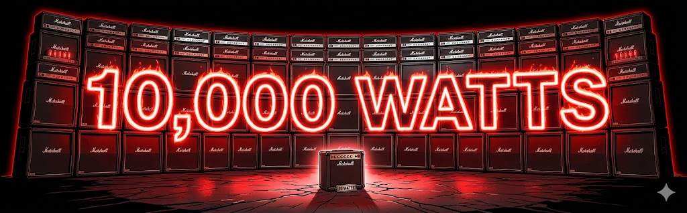
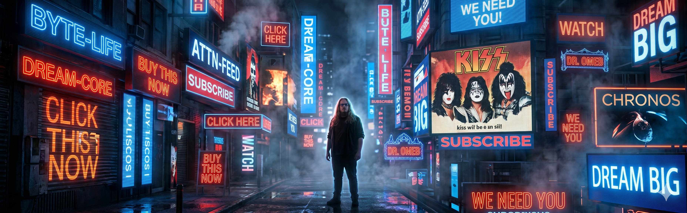
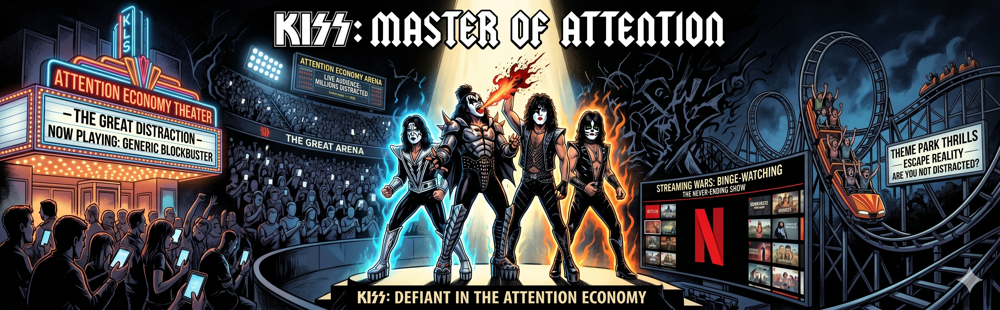
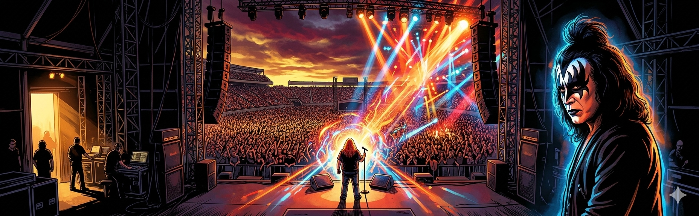
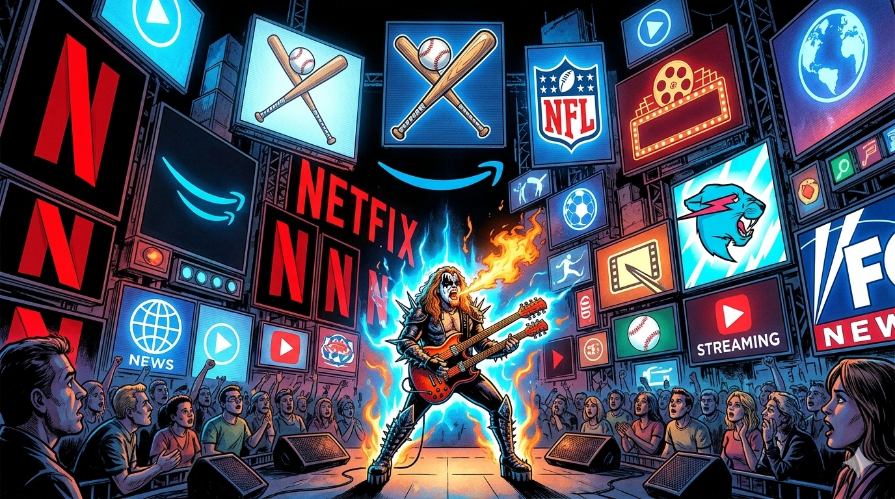
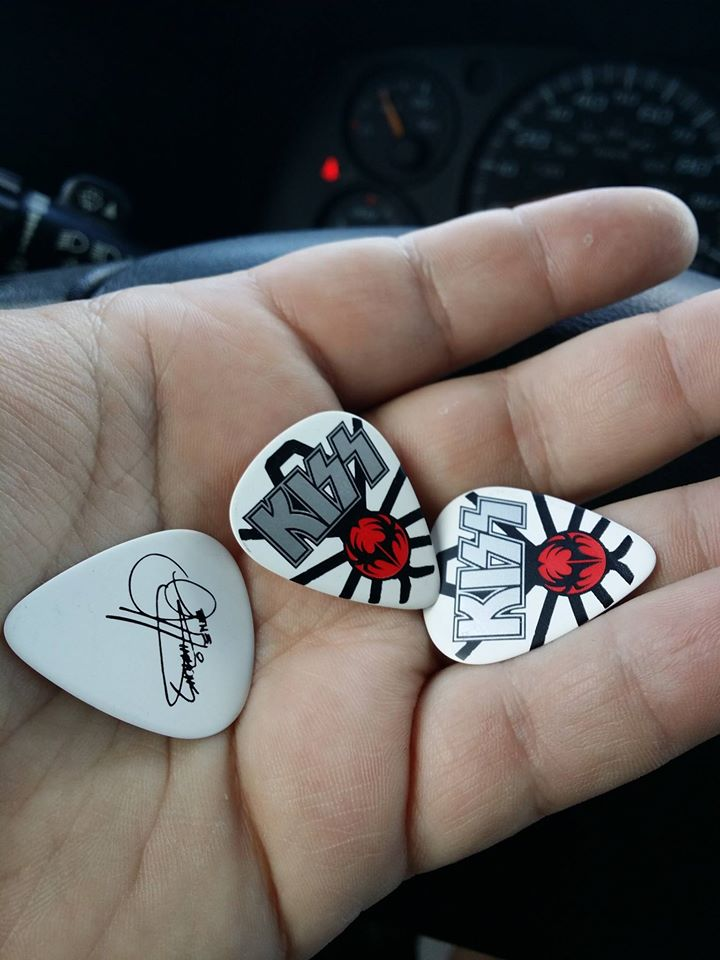

# Your Brand Is Losing a War for Attention: KISS Figured Out How to Win It 50 Years Ago

## Backed-up images

---
**Citizens of Rock n' Roll,** right now, someone is trying to get your attention. So is someone else. And about 9,998 other someones after that.

Research estimates that the average American encounters somewhere between 4,000 and 10,000 brand messages every single day. Billboards, pre-roll ads, sponsored posts, email subject lines, podcast reads, logo placements on jerseys — the number keeps climbing because the channels keep multiplying. Here's the part that should genuinely concern you if you're trying to build an audience, sell a product, or get anyone to care about what you do: of those thousands of messages, fewer than 100 actually break through to conscious awareness. The rest is wallpaper.

**That's not a marketing problem. That's a war, and most brands are showing up with a slingshot.**

What makes this especially interesting from a marketing standpoint is that the noise floor wasn't always this high. Back in the 1970s, estimates put daily ad exposure somewhere between 500 and 1,600 messages — a fraction of what we navigate today. Which means KISS, the band that built one of the most systematically dominant marketing operations in the history of rock and roll, was solving the attention problem before the attention problem became the existential crisis it is now. And the solution they found turns out to be more relevant in 2025 than it was in 1974.

I've taught KISS as a marketing case study in my Marketing Management capstone course at Thomas More University. We used their story to work through positioning strategy, the marketing mix, product line management, and competitive analysis. Every single concept clicked faster when it was anchored to a band students already had opinions about, because KISS made their strategy visible in a way that most brands deliberately hide. What they did wasn't subtle. It was designed to be seen from the back row of an arena.

But the most important thing KISS understood — the insight that most musicians and most brands still manage to miss — isn't really about pyrotechnics or face paint or coffin-shaped merchandise. It's about who they understood their competition to actually be.

Most bands think they're competing against other bands. KISS figured out that was the wrong frame entirely. They were competing for a share of their audience's entertainment dollar, which meant their real competition was movies, sporting events, theme parks, and every other claim on someone's Friday night and disposable income. Once you understand that, the entire strategic picture shifts. You stop asking "how do we make a better album than the other rock bands" and you start asking "why would someone choose THIS over literally everything else fighting for their attention right now." That's a completely different question, and it produces completely different answers.

The answers KISS came up with were: iconic visual personas that were impossible to mistake for anyone else, a live show so over-the-top that people talked about it for years afterward, a fan club that functioned less like a mailing list and more like a tribal identity, and a merchandise operation so vast it eventually included coffins, condoms, and branded wine. None of that is random. Every element was designed to occupy space in the audience's mind that no competitor could easily claim, and to keep the brand present in daily life even when the band wasn't on tour.

What they built, in the language I use in the classroom, was a high-quality, premium-priced offering supported by heavy promotion and wide distribution — and every element of their marketing mix pointed in the same direction. The product was the spectacle. The price signaled that this was an event, not just a show. The promotion was relentless and visual and impossible to ignore. And the distribution, particularly of merchandise, meant the KISS brand was everywhere a fan could look. That kind of alignment doesn't happen by accident. It happens because someone decided what position they wanted to own in the market and then built everything to support it.

I've had the privilege of performing on the pre-show stage at Riverbend Music Center here in Cincinnati before some of the greatest rock acts in history — KISS, Mötley Crüe, Van Halen, Def Leppard, Rush, ZZ Top, Journey, Megadeth, and more. I've stood in the wings and watched how these operations run from close range. The KISS show on July 15, 2014 — KISS and Def Leppard on the same night, which is just an absurd amount of rock and roll — was one of those nights. Before my set, I noticed a guy walking around with credentials, taking pictures, making phone calls, clearly sizing things up. Then he disappeared. After I came off stage, he came back and found me. "Hey, I'm Gene's guitar tech. I called him and he checked you out for a few minutes. He loves your act and asked me to give you some of his picks."

I still have them.

That moment stuck with me for reasons that go beyond the obvious flattery of it. Because what Gene Simmons did — sending someone to scout the pre-show act, paying attention to what was happening on his stage before he even got there — is exactly the behavior you'd expect from someone who understood that attention is the game. You don't build what KISS built by being incurious about your environment. You build it by treating every touchpoint, every square inch of the experience, as something worth managing deliberately.

That discipline is what separates the brands and artists who break through from the ones who don't. And the noise floor in 2025 is roughly ten times higher than it was when KISS was first building their playbook, which means the stakes are proportionally higher for everyone trying to get heard.

Whether you're a band, a brand, a university, or any other business, you have to ask yourself one question: what would KISS do? Because if you aren't doing something to rise above the 10,000-watt amplifier of our modern noise floor, nobody is going to hear your 10-watt, vanilla marketing pitch. The audience isn't waiting for you to show up. They're already drowning in everyone else who showed up first.

Make them remember you were there.

---

**Want more rock n' roll business lessons delivered straight to your inbox?** Subscribe to Diary of a Rock n' Roll Doctor and never miss a post. New analysis drops weekly!
