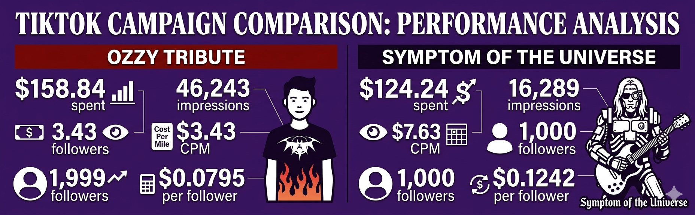
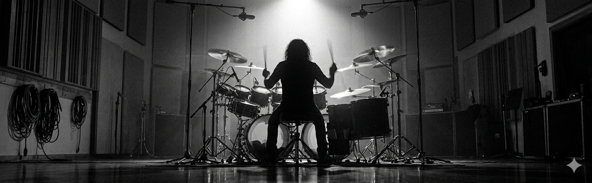
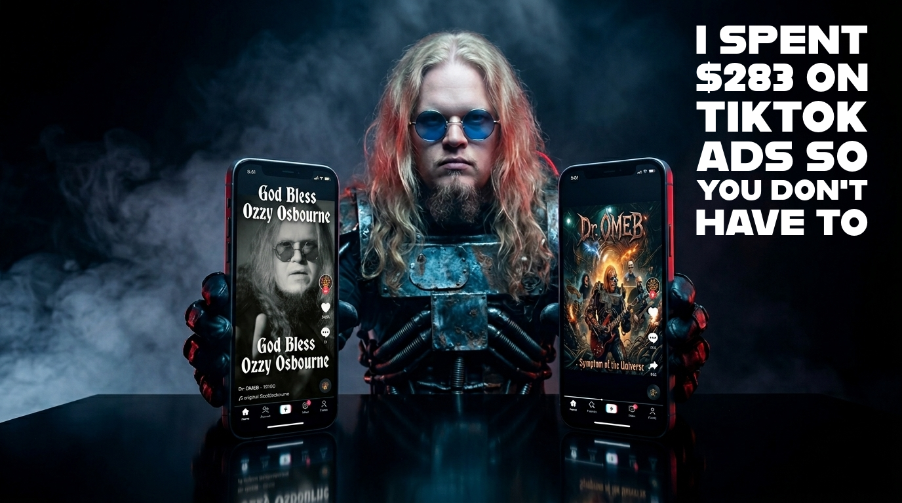

# I Spent $283 on TikTok Ads So You Don't Have To. Here's What the Algorithm Taught Me About Emotional Framing.

## Backed-up images

---

Citizens of Rock n' Roll, I just spent $283 on TikTok ads so you don't have to. You're welcome.

Here's the setup. I'm a marketing PhD who has been performing as the One Man Electrical Band (Dr. OMEB) since 2003, which means I have spent two decades doing things the hard way and then eventually figuring out why. Not for lack of effort, but from lack of support and resources and having to run this race alone. This month I ran two TikTok Spark Ad campaigns on two of my own music videos, kept the variables controlled like the nerd I am, and documented everything. What came back was a master class in two things every marketer thinks they understand and almost nobody applies in practice: the algorithm doesn't care what you think your content deserves, and emotional framing will outwork production value every single time. Let me show you what I mean.

### **The Experiment**

Both campaigns ran with identical settings. Same objective — community interaction, meaning follower growth. Same daily budget of $20, which is the lowest amount TikTok will let you spend. Same age targeting: 35-44, 45-54, 55 and up. Same locations: United States, Brazil, Mexico (where the metal heads live in this hemisphere). Same format: Spark Ads, which promote existing organic posts rather than standalone ads. Only one thing changed between the two campaigns, and that was the video itself. One variable. That's what makes the data worth talking about.

Campaign one ran on my tribute to Ozzy Osbourne — a cover of "Close My Eyes Forever" that I re-posted the day after he died with the text overlay "Rest in Peace Ozzy Osbourne." Before I spent a dollar on it, that video already had 45,334 organic views and had gained 268 followers on its own. The audience had already told the algorithm something about who wanted to see this content, which matters more than most people realize.

Campaign two ran on my recently released cover of Black Sabbath's "Symptom of the Universe," featuring Vinny Appice — the drummer who replaced Bill Ward in Black Sabbath and later played for Dio. This was a genuine bucket list project. Over 60 hours of production work, cinematic AI-assisted artwork, and getting to record with one of my childhood heroes. After 35 days on TikTok, it had 415 views. The algorithm had already moved on, and I was running a rescue campaign on a video that was, by any reasonable measure, dead.

One note on the spend numbers you're about to see. Both campaigns ran on the same $20 daily budget, but the Ozzy campaign delivered faster and burned through more total budget before I shut it down, while the Symptom campaign ran longer at a slower delivery pace and spent less overall. That difference in total spend is itself part of the result — TikTok was happy to spend my money on the Ozzy video and reluctant to spend it on the Symptom video, which tells you which one the algorithm wanted to serve.

### **What Happened**

The Ozzy campaign spent $158.84 and came back with 46,243 impressions at a CPM of $3.43. It brought in 1,999 new followers at $0.0795 each and pushed the video from 45,000 views to 92,000. Twenty-five and a half percent of that traffic came from search, meaning people were actively looking for Ozzy tribute content and finding mine.

The Symptom campaign spent $124.24 and came back with 16,289 impressions at a CPM of $7.63. It brought in 1,000 new followers at $0.1242 each and pushed the video from 415 views to 18,000. Ninety-seven and a half percent of that traffic came from the For You page, which means nobody was searching for it. TikTok was doing all the work of finding an audience that didn't know it wanted the content yet, and it was charging me accordingly.

The CPM gap between those two campaigns — $3.43 versus $7.63 — is the whole story in two numbers. When TikTok charges you 122% more per thousand impressions, that's not a billing glitch. That's the algorithm telling you, in dollar amounts, that it doesn't know who wants your content. It's casting a wider net because you didn't give it enough signal to cast a narrow one, and you're paying for every extra cast.

### **About That Benchmark**

A quick word on what good actually looks like here, because I want to be careful with the numbers I cite. If you search for "cost per follower" you'll find a lot of figures floating around between $0.005 and $0.05, and most of them are useless to you and me. Those numbers describe what happens when you let the ad platforms do the targeting for you or you purposefully run ads in Asian countries which are cheap to advertise in (and loaded with bot farms). Two different metrics. Don't let anyone tell you otherwise.

The closest apples-to-apples comparison I could find for what I actually ran is from Andrew Southworth at Music Marketing Monday, who documented a follower growth campaign across the United States, Canada, Brazil, and Mexico. He spent around $50, gained 265 followers, and averaged $0.19 per follower. Same campaign type, same general geography, real practitioner data. Check him out — [**musicmarketingmonday.com**](http://musicmarketingmonday.com/).

Against that benchmark, the Ozzy campaign at $0.0795 was exceptional and the Symptom campaign at $0.1242 was still solid. Both beat the only real-world number I could verify. But the gap between them is where the lesson lives, and that's the part worth talking about.

### **What TikTok Actually Rewards**

The lesson sitting inside this data is bigger than emotional framing. The algorithm doesn't reward content you believe in. It rewards content that already has organic signal, and it charges you a premium when you ask it to find an audience for something the audience hasn't already found.

The Ozzy video had 45,000 organic views and 268 followers gained before I spent a dollar. The algorithm already knew who wanted it, and the ad spend just opened the floodgates. The Symptom video had 415 views after 35 days, so the algorithm had already decided, and my ad spend was asking it to reconsider.

Most creators get this wrong, myself included. We look at our catalog and we boost the thing we're proudest of, the thing with the highest production value, the thing we think deserves more attention. The algorithm shrugs and charges us double, because we just asked it to do work it had already declined to do for free.

The rule is simpler than it sounds. Amplify proven momentum and do not force what didn't work. If a piece of content has organic signal — views accumulating, shares happening, follower count ticking up on its own — that's the algorithm telling you it has found the audience, and your job at that point is to pour gasoline on the fire. If a piece of content is sitting dead at 415 views after a month, the algorithm has told you it cannot find the audience, and ad spend doesn't change that conclusion. It just makes you pay more to learn it.

### **What I Got Wrong**

I buried the story. Vinny Appice is not a production credit. He's the drummer who stepped into one of the greatest rock bands in history under circumstances no musician would want — filling in for a founding member, mid-tour, when the stakes were as high as they get in this business — and then did it again, and kept showing up, because he was simply that good. Bill Ward's performance on "Symptom of the Universe" is considered one of the greatest drum performances in rock history, and I got to record that song with the man who carried that legacy forward, who also happens to be one of my childhood musical heroes. That is a human story. That is something a person who has never heard of Black Sabbath could feel something about. Instead I led with the production value and left the emotional core sitting in the parking lot, so the algorithm had no idea what to do with it. It went looking, and sent me the invoice.

### **The Lesson That Applies to Every Industry**

The temptation when you have credentials is to lead with the credentials. I had a Metal Hall of Fame drummer, 60 hours of production work, and AI-generated cinematics that I'm genuinely proud of, so that's what I led with. The audience shrugged.

The Ozzy tribute worked not because Ozzy died, which is an event I can't replicate. It worked because grief is a complete emotional experience that doesn't require any context. You don't need to know who Ozzy is to understand that someone is mourning something they loved. That's the thing emotional framing does that credential framing cannot, which is to give people a reason to care before they have a reason to be interested.

This applies whether you're an independent musician, a small business owner running your first Meta campaign, or a B2B marketer trying to figure out why your case study content underperforms your thought leadership content. The case study is the credential. The thought leadership, when it's done right, is the emotion. One of those tells people what you've done. The other makes them feel something about why it matters.

Emotion scales. Credentials gatekeep. Plain and simple.

And one more thing while we're here. Cultural moments like Ozzy's death are not a strategy. You can't wait around for a metal icon to pass away every time you need to grow an audience. Emotional framing, on the other hand, is a skill, and skills are something you can build on purpose, with intent, on any piece of content, in any industry. That's the difference between getting lucky and getting good.

### **The Part You Can Actually Use**

Before you run a Spark Ad, or any ad, on anything, ask yourself two questions. First: does this content already have organic signal — views, shares, comments, followers gained — that tells the algorithm an audience exists? If yes, amplify it. If no, fix the framing and repost it to find the audience before you spend the money, because the algorithm will figure out the problem eventually and charge you the difference.

Second: is the emotional reason anyone should care visible in the first three seconds, or did you bury it under context the viewer hasn't earned yet?

Watch your CPM in the first 24 hours. If it's climbing toward $7.00 or above, TikTok is struggling to place your content and is passing the uncertainty cost along to you. That's your signal to either accept the higher cost and let it run, or pause and rethink the creative before you go further.

Spark Ads, really any ads, are not magic. They are an amplifier, and amplifiers don't fix a bad signal — they just make it louder. But when you point them at content that already has momentum and a story worth telling, they are the most efficient growth tool I've found at any budget level, for any kind of content, in any industry.

Next time I have a story worth telling, I'm going to focus more on that than laying out the facts.

---

*Dr. Mike Carr is Dr. OMEB — Cincinnati's One Man Electrical Band. Catch Rock n' Roll Church live every Sunday at 9AM EST on TikTok @onemanelectricalband, or find the music at* [***onemanelectricalband.com***](http://onemanelectricalband.com/)*.*
