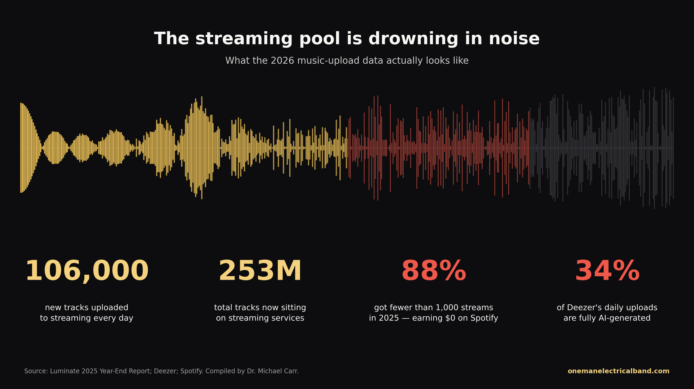
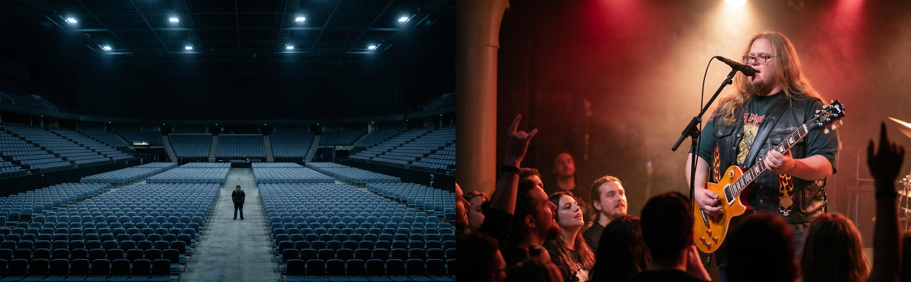
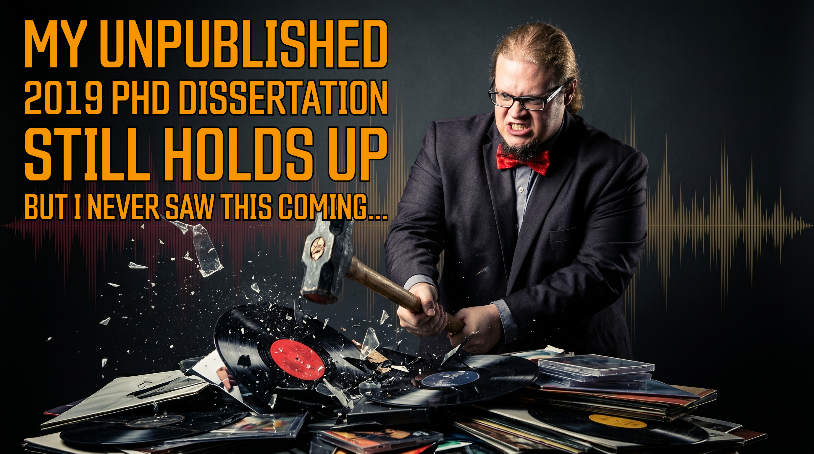
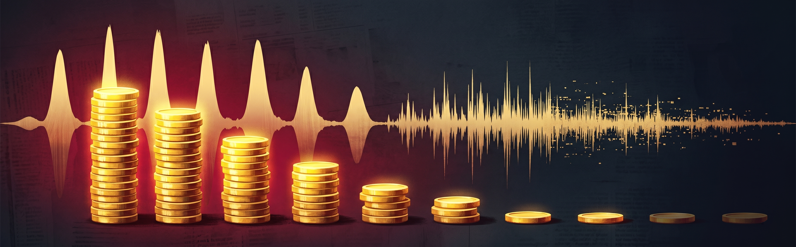
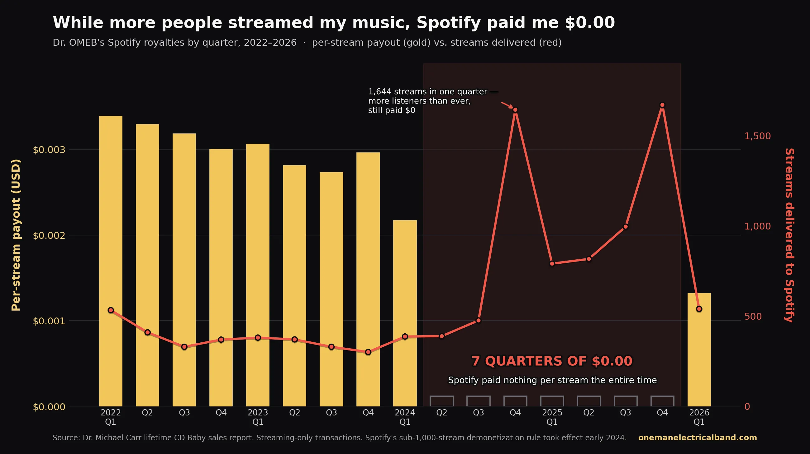

# My Unpublished 2019 PhD Dissertation Still Holds Up But I Never Saw This Coming...

## Backed-up images

---

Citizens of Rock n' Roll,

In 2019 I successfully defended a PhD dissertation that ran a statistical analysis on roughly 1.2 million streaming transactions from eight independent musicians, looking at how the top ten streaming services actually paid royalties between 2014 and 2018. The study found massive, statistically significant differences in what each platform paid for the same product — and most of those differences had nothing to do with which streaming service was the "biggest" or "most popular." My chair was supportive throughout, life got busy on both sides, and the research never made it to publication. The dissertation has been sitting in a drawer for almost seven years.

This week I pulled it back out, ran the same methodology against my own lifetime sales report from CD Baby, and discovered something I genuinely could not have predicted in 2019. I want to walk you through what the original study found, what my own data says now, and what happened to streaming when nobody was looking.

## What the dissertation actually said

The study compared average royalty payments across the ten biggest streaming services from 2014 to 2018: Amazon, Apple, Deezer, Google, iHeart Radio, Pandora, Slacker, Spotify, Tidal, and YouTube. I ran a one-way ANOVA and a Tukey pairwise comparison on 3,054 unique monthly royalty payments. The headline finding was that 86% of the pairwise comparisons between platforms showed statistically significant differences in what they paid per stream, and 30 of those 45 comparisons returned a p-value of 0.000. That is the statistical equivalent of saying these platforms aren't even pretending to pay artists comparable rates for the same product.

The two highest-paying services in the data, Tidal and iHeart Radio, were also the two newest entrants to the market. Their averages were higher because their user bases were smaller and the pro-rata royalty pool wasn't yet diluted by hundreds of millions of streams. As soon as they grew, the payouts dropped — which is exactly what supply-and-demand logic in a pro-rata pool would predict. The system was built to pay less as more music joined the pool, regardless of quality, popularity, or anything else a reasonable person might think should matter.

In hindsight, that was the entire warning. A finite revenue pool divided across an ever-growing number of tracks produces ever-smaller individual payouts. That's not a bug, that's just division.

What I did not see coming was generative AI showing up and pouring the contents of an industrial firehose directly into the pool.

## I ran the same analysis on my own data and it told me two stories

This week I pulled my lifetime sales report from CD Baby — 40,314 transactions going back to 2007 — and applied the same methodology I used in the dissertation. The validation check was the first surprise. For the years 2014 to 2018, my own one-artist data tracked the eight-artist dissertation averages remarkably closely. Tidal averaged $0.0116 per unique monthly payment in my data, compared to $0.0122 in the dissertation. iHeart Radio: $0.0142 vs $0.0140. YouTube: $0.0061 vs $0.0057. Spotify came in lower in my data than in the dissertation ($0.0035 vs $0.0042), but the rank ordering held: Tidal and iHeart Radio paid the most per stream, Spotify and Apple paid among the least. The 2019 findings still describe reality in 2026 for the same time period, which is honestly the cleanest scientific validation I could have hoped for.

Then I extended the analysis forward, and that's where the second story showed up — the one I really did not expect.

## Spotify quietly stopped paying me in Q2 2024

Here is what the data actually shows for my Spotify royalties, by quarter, from 2022 through early 2026:

Read those numbers carefully. My Spotify stream count went up during that period. In Q4 2024 alone Spotify delivered more than five times as many streams of my music as they had in any single quarter the year before, and they paid me exactly zero dollars for any of them. For seven consecutive quarters. While every other platform on my distribution list — Apple, YouTube, Amazon, Tidal, iHeart Radio — kept paying at roughly the same per-stream rate they always had.

What happened is that Spotify quietly introduced a new monetization rule in early 2024. Any individual track that does not reach at least 1,000 streams within a rolling 12-month window earns nothing. Zero. The streams still happen, the listeners still hit play, the data still gets reported back to your distributor — and your royalty for those plays is officially $0.00. Industry estimates have it that independent artists collectively lost around $47 million in royalties in 2024 from this rule alone, and most of them never knew the rule existed. I sure didn't, until I ran the math on my own data this week.

And here is the part that should make every independent artist sit up straight: I am a small artist by any reasonable industry definition. I have no label, no manager, no publicist, and no chart-topping single. What I do have is roughly 90,000 followers across my platforms, with 19,000 of those on TikTok. By streaming-platform standards, that's a rounding error. And Spotify's algorithm was still able to look at my individual track-by-track stream counts and decide I had not earned a single cent of the royalty pool for seven straight quarters. If that can happen to a working musician at my scale, it is happening to most of the people you have ever heard play a bar.

## The 106,000 tracks a day problem

Now here is where the dissertation thesis comes together with the 2026 reality. According to Luminate's 2025 Year-End Report, an average of 106,000 new tracks were uploaded to streaming services every single day in 2025. There are now 253 million tracks sitting on streaming services worldwide. Of those, 88% received fewer than 1,000 streams in 2025 — which means under Spotify's new threshold, 88% of the music on the platform earned exactly zero in royalty payments last year. Deezer reported that by November 2025, roughly 50,000 of the tracks they received per day — 34% of their daily uploads — were fully AI-generated. Spotify removed more than 75 million spammy tracks from its platform across the year. Universal Music Group's CEO Sir Lucian Grainge called it "AI slop" in his 2026 New Year address.

The 1,000-stream threshold is Spotify's response to the AI flood. The logic is straightforward and not entirely unreasonable: if your track gets fewer than 1,000 plays a year, the cost of cutting you a check is more than the check is worth, and a lot of the under-1,000 tracks are bot-generated noise. The problem is that the threshold doesn't care whether you are a bot uploading slop or a working human musician with a real but modestly-sized audience for any individual song. It treats both exactly the same.

My 2019 dissertation said the pro-rata royalty pool was creating chaotic, unpredictable payouts that bore no logical relationship to artist value. The 2026 update writes itself: the pool became so polluted that the platform's response was to stop paying the bottom 88% of the catalog entirely, and the bottom 88% includes a lot of human musicians whose only crime was not gaming the algorithm hard enough.

## Change the room

In 2014, the song "Happy" by Pharrell Williams was played 43 million times on Pandora in a single quarter. The check Pharrell received for that historic run, in songwriter and publisher royalties, was $2,700. That works out to about $60 per million plays. Read that again, because the number deserves its own beat. A number-one global hit, by a Grammy-winning artist with a Sony/ATV publishing deal, made $60 per million plays. Pharrell's CEO at Sony/ATV called it "totally unacceptable" in a public letter, and twelve years later the math has only gotten worse.

I have made more money in the last eight months hosting Rock n' Roll Church on TikTok Live than Pharrell made from 43 million streams of one of the biggest pop songs of the 2010s. I just crossed 1 million diamonds on TikTok streaming a few days a week from my home studio in Cincinnati, with no label, no publicist, and a song catalog that Spotify has officially valued at zero dollars for seven straight quarters. The audience is real, the income is real, and the room is one I built myself.

That is the entire argument. Streaming is the wrong room to be in if you want to earn real money as an artist. The pro-rata pool was already chaotic when I studied it in 2019, the AI flood broke whatever was left of it in 2024, and the platforms responded by quietly cutting most working musicians out of the payout structure entirely. The data on my own sales report proves it. You can keep optimizing for that room and earning fractions of a cent, or you can change the room.

I changed the room. I am not famous, I am not signed, I am not on a magazine cover. But I am, by any honest measure, doing better than the math on a number-one hit. That is not a story about me. That is a story about what room you choose to be in.

Pick a better room.

---

**Catch Rock n' Roll Church live every Sunday at 9 AM EST on TikTok** [**@onemanelectricalband**](https://www.tiktok.com/@onemanelectricalband)**. Join the mailing list at** [**onemanelectricalband.com**](https://onemanelectricalband.com) **so the streaming algorithms aren't the ones deciding whether you hear from me.**
