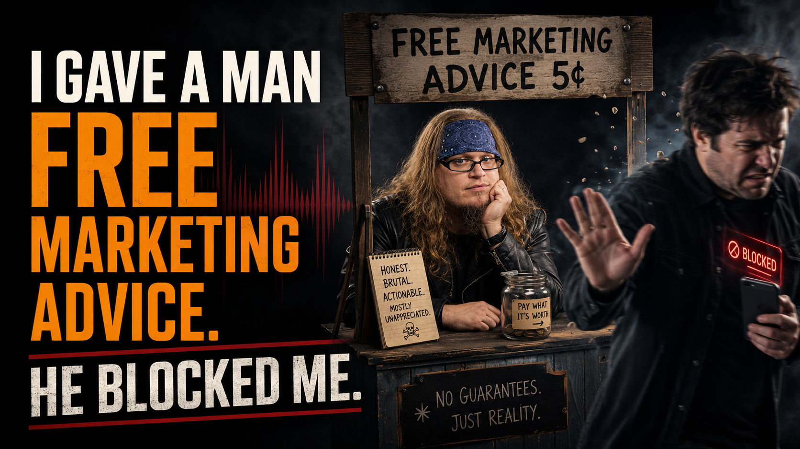

# I Gave a Man Free Marketing Advice. He Blocked Me.

## Backed-up images

---

Citizens of Rock n' Roll,

This past Sunday, I finally gave a man the free marketing advice he had been asking me for since 2018, and his response was to block me.

Let me back up. He and I had been connected on LinkedIn for years. He runs an internet radio station for independent artists, and somewhere along the way, he asked for my marketing expertise to help grow it. I never answered, and I'll own that, but you need to understand what my inbox looks like these days. Across five platforms, I get forwarded dozens, sometimes hundreds, of posts, videos, and links, and that's before we count the pitches for free work, the "quick calls" that are secretly job interviews, and the requests for free consulting. I make my posts, I do my Sunday show, I take care of family stuff, and that's about it, because that is all the hours there are.

So on Sunday, he messaged me again, except this time he wasn't asking. He informed me that since he had reposted my content and I had never reposted his, I was, and I'm quoting, "an unreliable and unwanted connection." I apologized and explained the volume problem. He countered that he gets thousands of messages a week and still finds time to help his connections, which I suppose makes him a better man than me.

So I decided he should finally get what he originally asked for, free of charge.

My honest professional read: people aren’t ignoring your station because your connections are flaky. They’re ignoring it because an independent internet radio station with no existing audience has almost no native discovery engine. You’re asking artists, listeners, and sponsors to invest attention and money in something they have no easy way to find, join, or monetize. The smarter move is not rebuilding a static website for a station that has been trying to find its market for twenty years. The smarter move is to become the visible talent yourself: go live on TikTok, Twitch, or YouTube, DJ in public, build community in real time, and use the platforms where discovery, chat, gifts, subscriptions, and monetization tools are already part of the behavior.

That was the message that got me blocked.

Now, I could file this under "guy has a bad Sunday" and move on, but I spent a few years teaching a graduate course at the University of Cincinnati called Advertising Management, and my former students will confirm that I never let a good failure go to waste. That course was built around a framework called ADPLAN, which grades advertising on six criteria, and the first one, sitting ahead of distinction, positioning, and everything else, is Attention.

It sits first for a reason. If you don't earn attention, nothing downstream of it exists, because your message, your offer, and your decades of history never happened for a person who wasn't looking.

And here is what my blocked friend never understood, and what most people chasing an audience in 2026 don't want to hear: everything in this business scales except attention. Your content library scales. Your follower count scales. Distribution is effectively free, since the same post reaches forty people or four million for the same effort. But attention, the actual hours a human being has to point their eyes at things, is fixed.

I have the same waking hours at 84,000 followers that I had when nobody was watching. Supply stays flat while demand explodes, and anyone who has ever bought from a scalper outside a sold-out show knows what scarcity plus demand does to a price. Attention became the most valuable asset in the market, and the moment anything becomes that valuable, people start counterfeiting it.

That is exactly what the repost-for-repost economy is: counterfeit attention. Circles of accounts dutifully sharing content that nobody inside the circle actually watches, a barter market where everyone trades receipts and nobody ever cashes one, so the numbers climb while the needle never moves.

Which brings me back to Sunday, because his real error wasn't his manners. He treated attention as a debt he could invoice: I reposted you, so you owe me. And demanded attention is worth exactly zero. It always has been.

Attention only carries value when it's given freely, because freely given attention is the only kind that arrives with an actual human attached, one who might listen, share, show up, or buy. An audience that watches because it owes you is a collections department, and collections departments don't buy merch.

The part that should sting is that the same assumption killed his station. Broadcast radio was born in an era when attention came owed by default, because there were three stations in town and you took whatever the DJ played. Scarcity did the earning on the station's behalf. The internet ended that scarcity. Every listener now carries the entire history of recorded music in their pocket, and attention has to be earned song by song, minute by minute, in public. He ran his network the same way he ran his station, assuming the audience owed him a listen.

One diagnosis, two symptoms.

I'm not writing this to dunk on the man, because I have been the man. In 2012, the recession cut my guitar studio from 55 students to 10, and I spent longer than I'd like to admit being angry at a market that owed me nothing. In the fall of 2023, when my friend Alexa told me to get on TikTok, I gave her the same energy my radio friend gave me. My exact words were, "Nobody's going to watch my old fat ass on TikTok."

I was defending twenty years of bars and gigs because the sunk cost was doing my thinking for me. The difference between him and me isn't talent, and it isn't luck. It's that when the diagnosis came, I swallowed the medicine, and within a year I went from 2,000 followers to 19,000+ on a platform I swore nobody wanted to see me on. Today, Rock n' Roll Church pulls three to ten thousand people into a live show every Sunday morning.

So here is the takeaway, whether you're pitching a label, a client, a venue, or a stranger's inbox.

Attention is earned, never owed.

Nobody owes you a listen because you followed them, reposted them, or landed in their DMs, and the moment you catch yourself keeping score, you've stopped marketing and started collecting. Before you hit send on the next pitch, skip the question of what they owe you and ask what you're giving them instead, because nobody owes you their attention, but almost everybody is starving for something worth giving it to.

If you want to watch earned attention work in real time, Rock n' Roll Church goes live Sundays at 9 a.m. ET on TikTok at @onemanelectricalband. The advice I gave that man is the same advice I took myself, and the proof airs every week.
