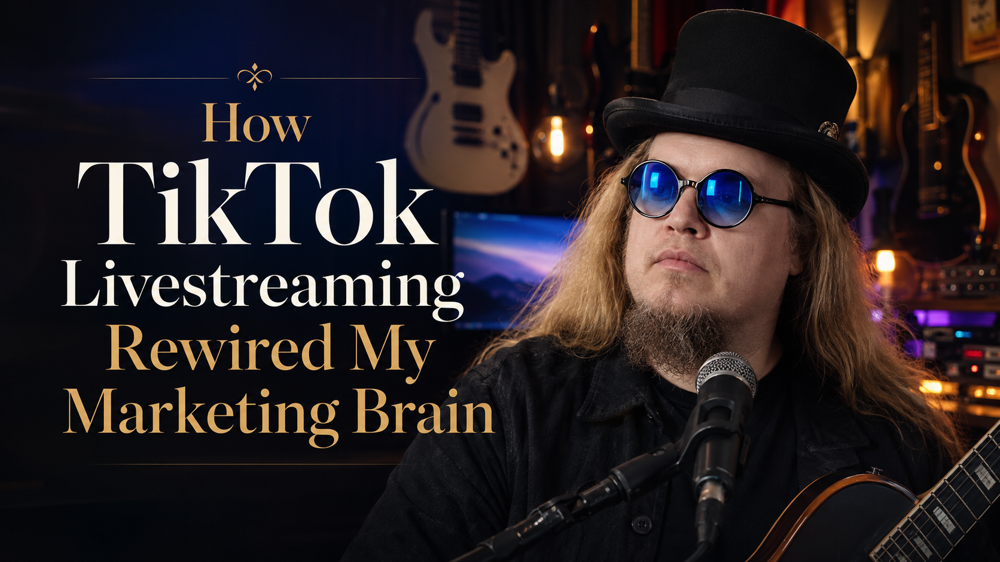
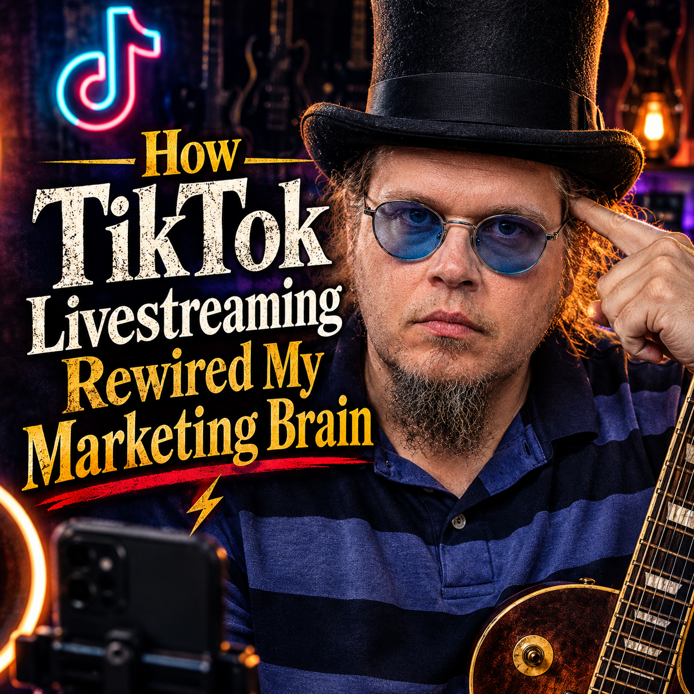
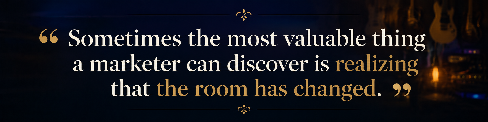
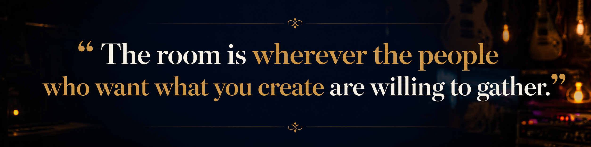
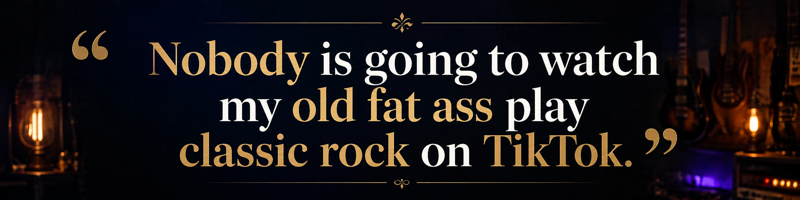
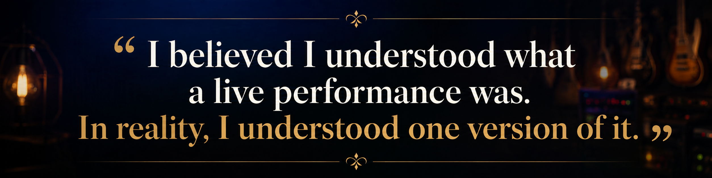
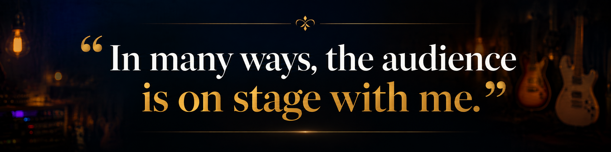

# How TikTok Livestreaming Rewired My Marketing Brain

## Backed-up images

---

A little over a year ago, I was ready to quit playing music. I had canceled my gigs and had more or less decided that I was finished with that part of my life. After more than 20 years of loading equipment into venues, playing for a few hours, tearing everything down and doing it again the next weekend, I had reached a point where I was questioning why I was still doing it.

That does not mean I was ungrateful for the people who came to see me. I was. But the reality of playing in bars is that most of the people in the room are not necessarily there because of the musician. They are there to have a drink, talk with friends, watch a game or simply spend an evening out. The performer is often part of the atmosphere. I used to joke that I was essentially a paid jukebox.

At that point in my career, my definition of success was also fairly simple: I played the gig and got paid at the end of the night. Music had become a job. I was not thinking about audience development, community building or content strategy. I was thinking about whether the check cleared and whether the next date was on the calendar. In the summer of 2025, I finally said, “Enough,” canceled all of my in-person shows and made a post saying I was done. Then my friend Alexa reached out to me.

Alexa had already built a successful presence on TikTok, and she told me I needed to start livestreaming. She believed it could completely change what I was doing with music. I was skeptical, to say the least. My response was something along the lines of, “Nobody is going to watch my old fat ass play classic rock on TikTok.” It turns out I was very wrong.

What makes that particularly interesting to me is that I have spent much of my professional life studying, teaching and practicing marketing. I have a Ph.D. in the field. I have worked with organizations on marketing and communications strategy, taught students how to understand audiences and spent years promoting my own music. Yet I had fallen into one of the easiest traps for anyone to fall into, regardless of experience: assuming that something must continue to be done a certain way simply because that is how it has traditionally been done.

For me, playing live music meant playing in a physical venue. That was the model I understood. A musician booked a show, promoted it, performed it and hoped people came through the door. Livestreaming felt like something different. It did not initially register in my mind as a legitimate substitute for a concert, but that assumption did not survive very long once I actually started doing it.

The most significant change was not the size of the audience, although that certainly mattered. The bigger change was the relationship I had with the people watching. In a traditional bar setting, interaction with the audience during a performance can be surprisingly limited. You may talk between songs or speak with people during a break, but much of the night involves performing while the audience does whatever brought them to the venue in the first place.

TikTok Live is completely different. I can see comments appearing while I am playing. I can react to something someone says, point to a comment that makes me laugh, acknowledge someone who sends a gift or recognize a familiar name when a regular viewer enters the stream. The people watching also interact with one another. Over time, they begin recognizing names, continuing conversations and developing relationships that exist independently of me. One of the biggest realizations I have had during the past year is that the audience is no longer simply standing in front of the stage. In many ways, the audience is on stage with me.

That has changed the way I think about marketing because it has changed what I measure. For years, the primary metric for a live performance was financial. Did the gig pay what I expected? Was it worth the time involved? Today, I still pay attention to revenue, but it is no longer the only measure that matters. I look at how many people watched the stream, how long they stayed, how many commented, how many shared it and how many decided to follow. I pay attention to whether familiar names return the following week and whether the community surrounding the livestream continues to grow. Those measurements tell me something that a check at the end of a bar gig never could: whether people are actively choosing to participate.

That distinction is important. Someone walking into a bar may encounter the musician simply because that musician happens to be performing that night. Someone watching a livestream can leave with a single swipe. Staying is a decision. Commenting is a decision. Sharing the stream with someone else is a decision. Returning the following week is another decision. Taken together, those actions create a very different picture of audience engagement.

Livestreaming has also changed the economics of content creation for me. When I played traditional gigs, I frequently tried to capture video that I could use later on social media. Anyone who has tried recording a performance in a dark bar knows how inconsistent that can be. The lighting may be terrible, the camera angle may be wrong, and the audio captured by a phone or camera may bear little resemblance to what people actually heard in the room.

My livestream setup gives me something entirely different. The performance itself becomes a source of content. TikTok retains the livestream for a period of time, which allows me to go back through the performance and identify moments that can become short-form videos. Those videos can then promote future livestreams, introduce new people to the music and continue working long after the original performance ended.

The livestream is no longer a single event. It becomes part of a larger cycle. The performance builds community, the community creates interaction, the interaction generates content, and the content brings new people into the next performance. As a marketer, that has been one of the most valuable changes in my thinking.

I should have recognized this sooner because much of my career has involved challenging conventional ideas about how things are supposed to work. When I created the One Man Electrical Band, I heard plenty of skepticism about whether one person could successfully perform the kind of music I wanted to play. The traditional assumption was that heavy music required a traditional band. I chose to experiment with something different.

I encounter the same resistance today whenever new technology changes the way creative work can be produced. Someone recently questioned why I used AI in one of my music videos. My answer was simple: it allowed me to create something I otherwise could not afford to make.

I do not have the budget for a massive animated production. New technology gave me another way to bring an idea to life. For me, the more interesting question is not why I would use the technology. It is why I would automatically refuse to consider it simply because it is different from the way the same work might have been produced in the past.

Oddly enough, livestreaming exposed the fact that I had developed exactly that kind of blind spot myself. I believed I understood what a live performance was because I had been doing it for more than two decades. In reality, I understood one version of it.

One of my moderators, DJ Helly, recently described what I do on TikTok in a way that I think captures the change perfectly. She said that I am not really doing a livestream. I am putting on a virtual concert. That distinction is everything.

The venue changed, but the purpose did not. I am still playing music for people who want to hear it. The difference is that the potential room is much larger, the audience can interact with me in real time, and the relationship does not have to end when the final song is over. If there is one idea that has stayed with me through this experience, it is how easy it is to misunderstand the room.

For years, I assumed the room was the bar, the club or whatever physical venue had hired me that night. That was where live music happened because that was where I had always experienced it. What I eventually realized was that the room was never really the building. The room is wherever the people who want what you create are willing to gather.

That realization has changed more than the way I perform music. It has changed the way I think about audiences, content, technology and marketing itself. It has made me much more willing to question the assumptions behind the systems I already understand instead of simply looking for ways to optimize them.

I am still figuring out what all of this becomes. Some livestreams perform better than others. Some ideas connect immediately, while others go nowhere. There is no formula that eliminates that uncertainty, and I would be suspicious of anyone who claimed otherwise.

What I can do is continue paying attention. I can study the numbers, listen to the audience, experiment with new ideas and make adjustments as I learn more. That is probably the biggest way TikTok livestreaming rewired my marketing brain. Experience can teach you a great deal, but it can also make you overly comfortable with the way things have always been done. Sometimes the most valuable thing a marketer can discover is not a new tactic. Sometimes it is realizing that the room has changed.
